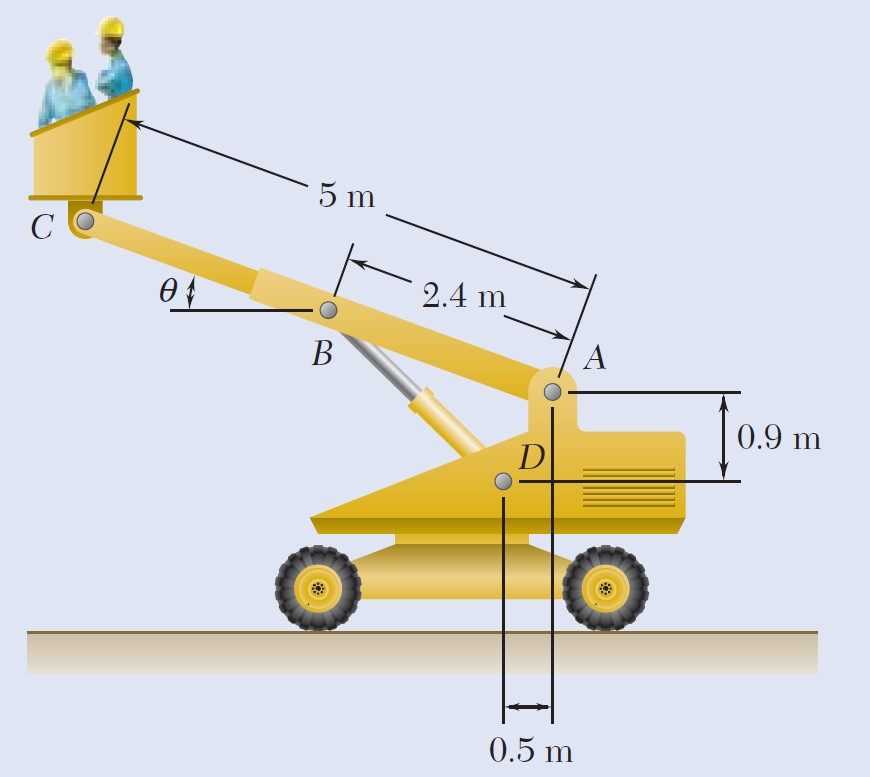

El bastidor de la figura soporta el cilindro de 50 kg. Determine las componentes horizontal y vertical de la reacción en A y la fuerza en C.

6-87. El montacargas soporta el motor de 125 kg. Deter- mine la fuerza que genera la carga en el elemento DB y en el elemento FB, el cual contiene el cilindro hidráulico H

6-92. La grúa de pared soporta una carga de 700 lb. Determine las componentes de reacción horizontal y ver- tical en los pasadores A y D. Además, ¿cuál es la fuerza sobre el cable en el cabrestrante W?

6-105. Determine las componentes de fuerza horizontal y vertical que ejercen los pasadores en A, B y C sobre el bastidor. El cilindro tiene una masa de 80 kg.

6-117. El montacargas se usa para soportar el motor de 200 kg. Determine la fuerza que actúa en el cilindro hidráu- lico AB, las componentes de fuerza horizontal y vertical en el pasador C, y las reacciones en el soporte fijo D.

6-129. Determine la fuerza en cada elemento de la ar- madura y establezca si los elementos están en tensión o en compresión.

6-128. Determine las fuerzas que ejercen los pasadores ubicados en A y B sobre el bastidor de dos elementos que sostiene a la caja de 100 kg.

7-30. La grúa fija sostiene una carga de 750 lb, la cual pende de un cargador montado en la parte superior del brazo. Determine la fuerza normal interna, la fuerza cor- tante y el momento flexionante de la grúa en el punto C del brazo, cuando el cargador está en la posición mostrada. Los elementos de la grúa están unidos mediante pasadores en B, E y F y se sostienen mediante un eslabón corto BH.

7-125. Determine la fuerza normal interna, la fuerza cortante y el momento flexionante en los puntos D y E del bastidor.

5-46. La grúa de piso y el conductor tienen un peso total de 2500 lb con un centro de gravedad en G. Determine el peso máximo del barril que puede levantar la grúa sin que esto cause una volcadura cuando la pluma está en la posición mostrada.

