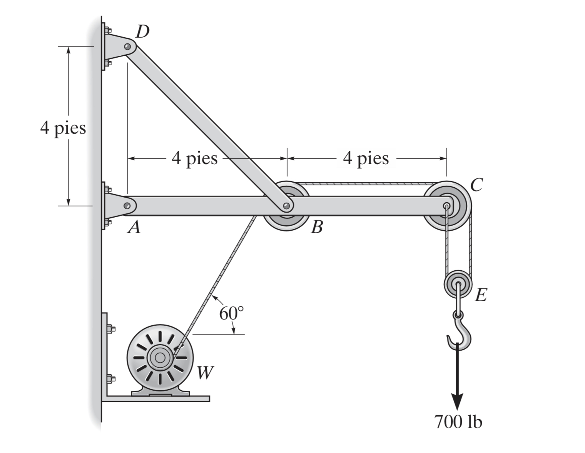
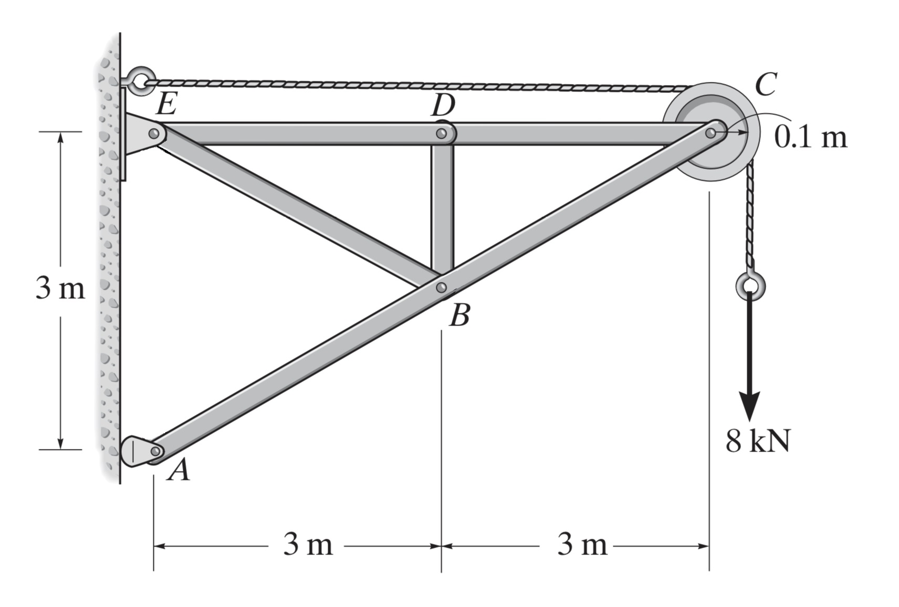

El bastidor de la figura soporta el cilindro de 50 kg. 
1. Determine el diámetro de los pasadores en B y C y las dimensiones de la sección transversal del elemento BC.
2. Determine el valor y la posición del momento flector máximo en el elemento ABD

El montacargas soporta el motor de 125 kg. 
1. Determine el diámetro de los pasadores en B y F y las dimensiones de la sección transversal del elemento BD.
2. Determine el valor y la posición del momento flector máximo en el elemento GFE

La grúa de pared soporta una carga de 700 lb. 
1. Determine el diámetro de los pasadores en A y D y las dimensiones de la sección transversal del elemento BD.
2. Determine el valor y la posición del momento flector máximo en el elemento ABC

El bastidor sostiene un cilindro que tiene una masa de 80 kg.
1. Determine el diámetro de los pasadores en A y B y las dimensiones de la sección transversal del elemento BC.
2. Determine el valor y la posición del momento flector máximo en el elemento ACD.

El montacargas se usa para soportar el motor de 200 kg. 
1. Determine el diámetro de los pasadores en A y C y las dimensiones de la sección transversal del elemento AB (cilindro neumático).
2. Determine el valor y la posición del momento flector máximo en el elemento GAC.

1. Determine el diámetro de los pasadores en A y E y las dimensiones de la sección transversal del elemento ED.
2. Determine el valor y la posición del momento flector máximo en el elemento ABC.

Con el brazo de extensión telescópica ABC se levanta una plataforma para trabajadores de la construcción. La masa conjunta de los trabajadores y de la plataforma es de 200 kg, y su centro de gravedad
compuesto se localiza directamente por encima de C. Para la posición en la cual θ = 20°:
1. Determine el diámetro de los pasadores en A y D y las dimensiones de la sección transversal del elemento BD (cilindro neumático).
2. Determine el valor y la posición del momento flector máximo en el elemento ABC.

La grúa fija sostiene una carga de 750 lb, la cual pende de un cargador montado en la parte superior del brazo. 
1. Determine el diámetro de los pasadores en A y E y las dimensiones de la sección transversal del elemento EF.
2. Determine el valor y la posición del momento flector máximo en el elemento AEB.

1. Determine el diámetro de los pasadores en A y F y las dimensiones de la sección transversal del elemento AC.
2. Determine el valor y la posición del momento flector máximo en el elemento AFB.

Para el armazón que se muestra en la figura:
1. Determine el diámetro de los pasadores en A y E y las dimensiones de la sección transversal del elemento BE.
2. Determine el valor y la posición del momento flector máximo en la porción comprendida entre los puntos C y D del elemento EDC.

